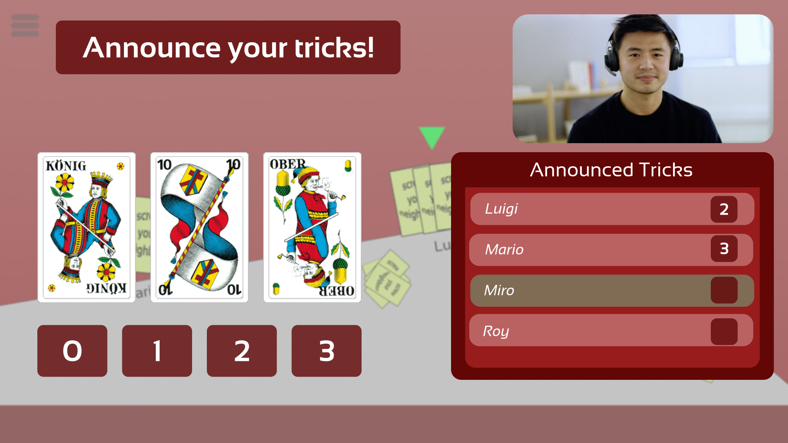
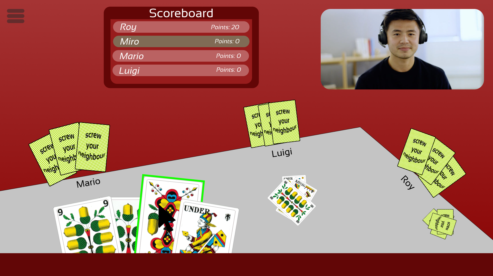

\centering

# SCREW YOUR NEIGHBOR

Report for Milestone 2 of Sopra FS22, Group 36

**Members**

Carmen Kirchdorfer (20-720-132)  
Salome Wildermuth (10-289-544)  
Beat Furrer (07-542-392)  
Lucius Bachmann (11-060-274)  
Moris Camporesi (19-764-349)  

\newpage
\raggedright
## Diagrams

### Component Diagram

{height=70%}

\newpage

### Class Diagram

The Rapid Api Development Architecture provided by spring-data-rest will be used to develop the api.
The PagingAndSortingRepositories provide request handling, deserialization, crud on the database, serialization
and rendering of errors. Validation will be implemented with Bean validations and if necessary with Spring event
handlers. Side effects will also be done with Spring event handlers. We decided to only include the Domain classes
in the diagram, because that tells the relations between the main concepts in the application.
Validation, the spring data rest resources (implemented with PagingAndSortingRepositories) and the event handlers
are depicted as package.

{height=60%}

\newpage

### Activity Diagram

{height=70%}

\newpage

## UI Mockups

\newpage
\newpage

## Rest Specification

### Description of the notation

We specify the Endpoints as follows:

### Endpoint /endpoints

**Model:**

Modelname

- PropType1 propName1
- PropType2 propName2

| Method            | Description                                |
|-------------------|--------------------------------------------|
| POST           | Post Request to /endpoints                 |
| GET            | Get Request to /endpoints (GET collection) |
| GET /{id}      | Get Request to /endpoints/{id} (GET item)  |
| PATCH /{id}    | PATCH Request to /endpoints/{id}           |
| DELETE /{id}   | DELETE Request to /endpoints/{id}          |

\newpage

We don't use the PUT Request, because all functionality  we need of a PUT
Request can be done with a PATCH request, and the PATCH request is easier.

All Endpoints support at least:

- Accept: application/hal+json
- Content-Type: application/hal+json (POST, PATCH)

The Parameter Types are as follows:

- {id}: Patch Parameter
- Model: Body Parameter (as application/hal+json)
- ?sort= and ?propName1= filters : Query Parameter

### Endpoints

#### Endpoint /players

**Model:**

Player

- int id
- String name

| Method           | Response Codes                                                                   | Description                                     |
|------------------|----------------------------------------------------------------------------------|-------------------------------------------------|
| POST             | 201   400   422 (Player for this session already exists)                | Creates a Session and a Player for this Session |
| GET              | 200                                                                           |                                                 |
| GET /{id}        | 200   403 (Not Allowed to see player)   404                             |                                                 |
| PATCH /{id}   | 200   400   404   422   403 (Not Allowed to patch other player)   | Set Player name                                 |

Side effect: creates a session that we can identify which player performs the request.

\newpage

#### Endpoint /games

**Model:**

Game

- int id
- String name
- Enum state
- Collection players (embedded)
- Collection matches (embedded)

| Method            | Response Codes                                                                                                       | Description             |
|-------------------|----------------------------------------------------------------------------------------------------------------------|-------------------------|
| POST              | 201   400   422 (Cannot create a room when already in a room)                                                  | Creates a new game room |
| GET               | 200                                                                                                                  |                         |
| GET /{id}         | 200   404   403 (Not Allowed to see room)                                                                      |                         |
| PATCH /{id}       | 200   400   404   422   403 (Not Allowed to patch game you are not in)                                   | Update game name        |
| DELETE /{id}   | 204   403 (Not Allowed to delete game you are not in)   404   422 (not allowed to delete game with players) | Delete the game         |

Side Effects:
If state is patched to playing, then a new Match is created and a hand for each player is created.

#### Endpoint /participations

**Model:**

Participation

- int id
- boolean active
- int playerOrder
- Player player (embedded)
- Game game (embedded)

| Method           | Response Codes                                                                                                                       | Description          |
|------------------|--------------------------------------------------------------------------------------------------------------------------------------|----------------------|
| POST          | 201   400   404 Game not Found   422 (Game closed)                                                                          | Enter Game as Player |
| PATCH /{id}   | 200   400   403 (Not Allowed to patch the participation of another player)   404   422 (update only allowed to inactive) | Mark as inactive     |

#### Endpoint /matches

**Model:**

Match

* int id
* int matchNumber
* int numberOfPlayedCards (calculated property)
* Collection scoreAnnouncements (embedded)
* Collection rounds (embedded)
* Collection hands (embedded)

Hand

* Participation participation
* Collection card (embedded)

Card

* int id
* Suit? suit (may be null if the card is hidden)
* Rank? rank (may be null if the card is hidden)

| Method    | Response Codes                                                             |
|-----------|----------------------------------------------------------------------------|
| GET /{id} | 200   403 (Not Allowed to see match)   404 (Match with id not found) |

#### Endpoint /scoreAnnouncements

**Model:**

ScoreAnnouncement

* int id
* int announcedScore
* Participation participation
* Match match

| Method    | Response Codes                                                             | Description              |
|-----------|----------------------------------------------------------------------------|--------------------------|
| POST   | 200   403 (Not your turn, player not in match)   422 (invalid score) | Announce Score for Match |

Side Effects: if all ScoreAnnouncement are made, a new Round is created.

#### Endpoint /rounds

**Model:**

Round

* int id
* int roundNumber
* Player winner
* Collection turns

| Method         | Response Codes                                                             |
|----------------|----------------------------------------------------------------------------|
| GET            | 200   403                                                               |
| GET /{id}   | 200   403 (Not Allowed to see round)   404 (Round with id not found) |

#### Endpoint /turns

**Model:**

Turn

* int id
* Round round
* Card card

| Method    | Response Codes                                                                     | Description              |
|-----------|------------------------------------------------------------------------------------|--------------------------|
| POST   | 200   403 (Not your turn, player not in match)   404   422 (invalid card) | Announce Score for Match |

If the last turn of a round is made, then the round is ended.
If it was the last round of the last match, the game is finished.

###

The Endpoints to create a User, to log in and log out are left out.
We don't know yet if we will implement them.
