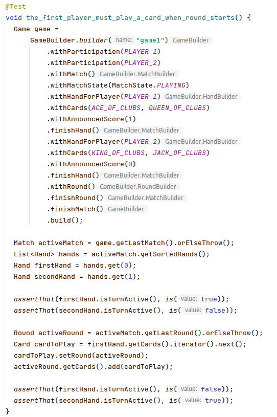
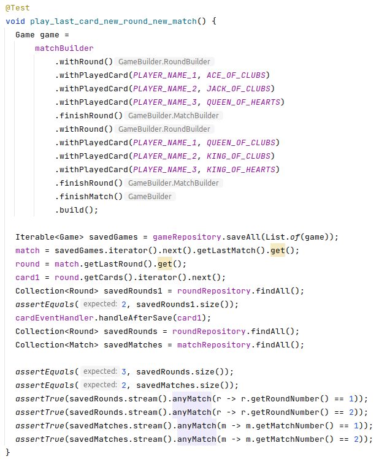

\centering

# SCREW YOUR NEIGHBOR

Report for Milestone 3 of Sopra FS22, Group 36

**Members**

Carmen Kirchdorfer (20-720-132)  
Salome Wildermuth (10-289-544)  
Beat Furrer, group leader (07-542-392)
Lucius Bachmann (11-060-274)  
Moris Camporesi (19-764-349)

\newpage
\raggedright
## Diagrams

### Database Schema
{height=60%}

#### Data Types
We were not sure how JPA stores Java data types in its tables. We found a
[mapping](https://www.logicbig.com/tutorials/java-ee-tutorial/jpa/persistable-basic-types.html) from basic Java data
types to the respective standard SQL data types. We also found that enum values are stored by default by there ordinal
i.e. with data type INTEGER. ([Source](https://www.logicbig.com/tutorials/java-ee-tutorial/jpa/persisting-enum.html))

### Class Diagram
The class diagram that we handed in for M2 was quite sparse what was pointed out in the feedback. It has grown
significantly (and also changed a bit) meanwhile the development process and because we use it permanently as a basis
for our common understanding, we decided to hand in the current version again with the report for M3.
{height=60%}

## UI Screenshots

## Tests
### Complex unittest
**Test class:** HandTurnActiveTest 
**Test method:** the_first_player_must_play_a_card_when_round_starts() 
**Description:** 
 

### Integrationtest
**Test class:** CardEventHandlerTest 
**Test method:** play_last_card_new_round_new_match() 
**Description:**
 

### REST interface test
Vorschlag: change_gameState_to_playing in GameIntegrationTest

    void change_gameState_to_playing() {
        HttpHeaders responseHeaders =
            webTestClient
                .post()
                .uri("/players")
                .body(BodyInserters.fromValue(PLAYER_1))
                .exchange()
                .expectStatus()
                .isCreated()
                .expectBody()
                .returnResult()
                .getResponseHeaders();
    
        String sessionId = getSessionIdOf(responseHeaders);
        GAME_1.setName("game_1");
        String sessionId = getSessionIdOf(responseHeaders);
        GAME_1.setName("game_1");
        
        // Create a new game
        webTestClient
            .post()
            .uri("/games")
            .body(Mono.just(GAME_1), Game.class)
            .header(HttpHeaders.COOKIE, "JSESSIONID=%s".formatted(sessionId))
            .exchange()
            .expectStatus()
            .isCreated()
            .expectBody()
            .jsonPath("name")
            .isEqualTo(GAME_1.getName())
            .jsonPath("_embedded.participations")
            .isNotEmpty()
            .jsonPath("_embedded.participations[0].player.name")
            .isEqualTo(PLAYER_1.getName());
    
        Long id = gameRepository.findAllByName("game_1").get(0).getId();
        String uri = "games/" + id.toString();
        GAME_1.setGameState(GameState.PLAYING);
    
        Map<String, GameState> patchBody = Map.of("gameState", GameState.PLAYING);
        // Without check whether the game exists (no get()) change the gameState with patch() request
        webTestClient
            .patch()
            .uri(uri)
            .contentType(MediaType.APPLICATION_JSON)
            .header(HttpHeaders.COOKIE, "JSESSIONID=%s".formatted(sessionId))
            .body(BodyInserters.fromValue(patchBody)) // Game 2 has different gameState = PLAYING
            .exchange()
            .expectStatus()
            .isOk()
            .expectBody()
            .jsonPath("_embedded.matches")
            .value(hasSize(1))
            .jsonPath("_embedded.matches[0].rounds")
            .value(hasSize(1))
            .jsonPath("_embedded.matches[0].rounds[0].roundNumber")
            .isEqualTo(1)
            .jsonPath("_embedded.matches[0].rounds[0].cards")
            .value(hasSize(0))
            .jsonPath("_embedded.matches[0].matchNumber")
            .isEqualTo(1)
            .jsonPath("_embedded.matches[0].matchState")
            .isEqualTo(MatchState.ANNOUNCING.name())
            .jsonPath("_embedded.matches[0].hands")
            .value(hasSize(1))
            .jsonPath("_embedded.matches[0].hands[0].announcedScore")
            .value(nullValue())
            .jsonPath("_embedded.matches[0].hands[0].cards")
            .value(hasSize(5))
            .jsonPath("_embedded.matches[0].hands[0].participation")
            .value(notNullValue());
}

