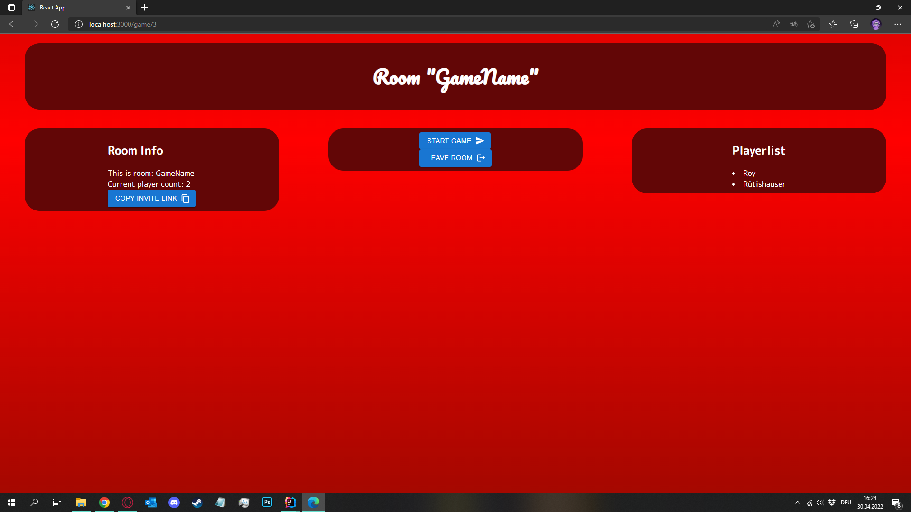
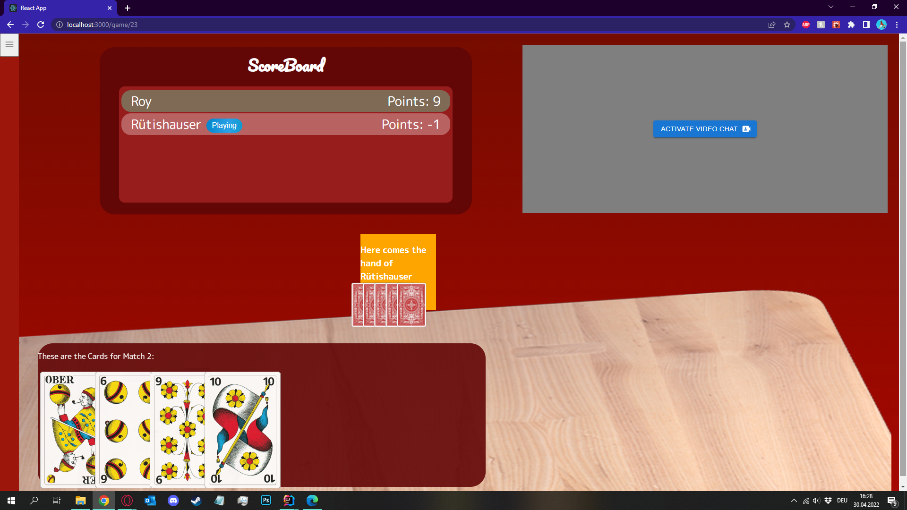
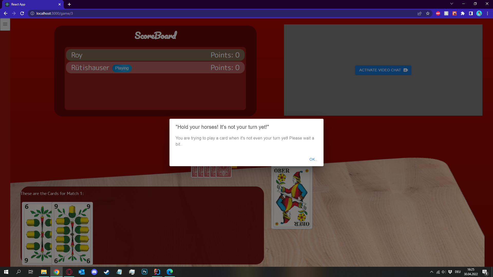

\centering

# SCREW YOUR NEIGHBOR

Report for Milestone 3 of Sopra FS22, Group 36

**Members**

Carmen Kirchdorfer (20-720-132)  
Salome Wildermuth (10-289-544)  
Beat Furrer, group leader (07-542-392)  
Lucius Bachmann (11-060-274)  
Moris Camporesi (19-764-349)

\newpage
\raggedright
## Diagrams

### Database Schema
{height=60%}

### Data Types
We were not sure how JPA stores Java data types in its tables. We found a
[mapping](https://www.logicbig.com/tutorials/java-ee-tutorial/jpa/persistable-basic-types.html) from basic Java data
types to the respective standard SQL data types. We also found that enum values are stored by default by there ordinal
i.e. with data type INTEGER. ([Source](https://www.logicbig.com/tutorials/java-ee-tutorial/jpa/persisting-enum.html))

### Attributes
The id is the corresponding tables primary key. It is a generated. FK stands for foreign key. All associations are 
realized on base of the ids.

### Class Diagram
The class diagram that we handed in for M2 was quite sparse what was pointed out in the feedback. It has grown
significantly (and also changed a bit) meanwhile the development process and because we use it permanently as a basis
for our common understanding, we decided to hand in the current version again with the report for M3.
{height=60%}

## UI Screenshots
### Start a game

### New match (and round) creation

### Prevent someone who's turn is not active from playing

## Tests
### Complex unittest
**Test class:** HandTurnActiveTest, <ins>[Code](https://github.com/sopra-fs22-group-36/screw-your-neighbor-server/blob/main/src/test/java/ch/uzh/ifi/hase/soprafs22/screwyourneighborserver/entity/HandTurnActiveTest.java) </ins>  
**Test method:** the_first_player_must_play_a_card_when_round_starts()  
**Use case:** Players are only allowed to play, when it is their turn.  
**Description:** This test method verifies whether the first player in the playing order is the one who's
turn is active while the other players turn is not active (assertion in block 2) and that the active turn
changes (assertion in block 3), after this first player has played his card (block 3). For that we set up
a small "toy game" with the help of GameBuilder, MatchBuilder and CardValue (block 1). You find some details
on these utility classes in separate sections below.

For this specific test, a game with two players (PLAYER_1, PLAYER_2) was instantiated. The two players have
two cards each (ace of clubs / queen of clubs and king of clubs / jack of clubs).

This is a typical unittest because it tests the state of one object (hand) by calling a single method (unit) of the application,
after having configured a certain context and again after a little change on this context (first player playing
card).

    void the_first_player_must_play_a_card_when_round_starts() {
        // block 1
        Game game =
        GameBuilder.builder("game1")
            .withParticipation(PLAYER_1)
            .withParticipation(PLAYER_2)
            .withMatch()
            .withMatchState(MatchState.PLAYING)
            .withHandForPlayer(PLAYER_1)
            .withCards(ACE_OF_CLUBS, QUEEN_OF_CLUBS)
            .withAnnouncedScore(1)
            .finishHand()
            .withHandForPlayer(PLAYER_2)
            .withCards(KING_OF_CLUBS, JACK_OF_CLUBS)
            .withAnnouncedScore(0)
            .finishHand()
            .withRound()
            .finishRound()
            .finishMatch()
            .build();
        
        // block 2
        Match activeMatch = game.getLastMatch().orElseThrow();
        List<Hand> hands = activeMatch.getSortedHands();
        Hand firstHand = hands.get(0);
        Hand secondHand = hands.get(1);
        
        assertThat(firstHand.isTurnActive(), is(true));
        assertThat(secondHand.isTurnActive(), is(false));
        
        // block 3
        Round activeRound = activeMatch.getLastRound().orElseThrow();
        Card cardToPlay = firstHand.getCards().iterator().next();
        cardToPlay.setRound(activeRound);
        activeRound.getCards().add(cardToPlay);
        
        assertThat(firstHand.isTurnActive(), is(false));
        assertThat(secondHand.isTurnActive(), is(true));
    }

### Integrationtest
**Test class:** CardEventHandlerTest, <ins>[Code](https://github.com/sopra-fs22-group-36/screw-your-neighbor-server/blob/main/src/test/java/ch/uzh/ifi/hase/soprafs22/screwyourneighborserver/api/CardEventHandlerTest.java) </ins>  
**Test method:** play_last_card_new_round_new_match()  
**Use case:** When the last card of the last round in a match is finished a new match (and also a new round) are initiated.  
**Description:** This test verifies whether a new round and a new match are created and saved in the Hibernate
database when all cards have been played in a match. For sake of completeness and understandability, we not only
list the test but also the setup method which is executed before the test. In the setup, a match with three players, each
of them having two cards is instantiated. In the test method the game context is completed by adding two rounds where all
players have played their cards. The game and all its associated entities is saved in this state in the database (note:
we only have to save the game thanks to the JPA cascade type "ALL"). 

Before we call the method under test _handleAfterSave(Card card)_, we verify whether the match has been saved
with its rounds and the played cards as expected (block 2). Note that we need a JPA queries for retrieving matches and cards, while
the rounds are attached to the retrieved match object. This is because we do not have implemented JPA fetch
type "EAGER" for all associations. With one of the played cards (it doesn't matter which one) we call the method under test
and after that we read all rounds and matches that are available in the database (block 3). There should be three rounds, (two have already
been saved before and now another one should have been created) and two matches. In addition we check, whether
the match and round numbers are assigned correctly (note: no round has the number 3, because for each new match, the
numbers start again with 1).

This is a typical integrationtest, as it does not only depend on an isolated unit of the application. There is not only
one method called and it's output verified, but also if the expected side effects happened, in this case, if the state
of previously saved database entites changed as expected.

    void setup() {
        matchBuilder =
            GameBuilder.builder("game1", gameRepository, participationRepository, playerRepository)
                .withParticipation(PLAYER_NAME_1)
                .withParticipation(PLAYER_NAME_2)
                .withParticipation(PLAYER_NAME_3)
                .withGameState(GameState.PLAYING)
                .withMatch()
                .withMatchState(MatchState.ANNOUNCING)
                .withHandForPlayer(PLAYER_NAME_1)
                .withCards(ACE_OF_CLUBS, QUEEN_OF_CLUBS)
                .finishHand()
                .withHandForPlayer(PLAYER_NAME_2)
                .withCards(KING_OF_CLUBS, JACK_OF_CLUBS)
                .finishHand()
                .withHandForPlayer(PLAYER_NAME_3)
                .withCards(QUEEN_OF_HEARTS, KING_OF_HEARTS)
                .finishHand();
    }

    void play_last_card_new_round_new_match() {
        // block 1
        Game game =
        matchBuilder
        .withRound()
        .withPlayedCard(PLAYER_NAME_1, ACE_OF_CLUBS)
        .withPlayedCard(PLAYER_NAME_2, JACK_OF_CLUBS)
        .withPlayedCard(PLAYER_NAME_3, QUEEN_OF_HEARTS)
        .finishRound()
        .withRound()
        .withPlayedCard(PLAYER_NAME_1, QUEEN_OF_CLUBS)
        .withPlayedCard(PLAYER_NAME_2, KING_OF_CLUBS)
        .withPlayedCard(PLAYER_NAME_3, KING_OF_HEARTS)
        .finishRound()
        .finishMatch()
        .build();

        Iterable<Game> savedGames = gameRepository.saveAll(List.of(game));

        // block 2
        match = savedGames.iterator().next().getLastMatch().get();
        round = match.getLastRound().get();
        card1 = round.getCards().iterator().next();
        Collection<Round> savedRounds1 = roundRepository.findAll();
        assertEquals(2, savedRounds1.size());
        cardEventHandler.handleAfterSave(card1);
        Collection<Round> savedRounds = roundRepository.findAll();
        Collection<Match> savedMatches = matchRepository.findAll();
    
        assertEquals(3, savedRounds.size());
        assertEquals(2, savedMatches.size());
        assertTrue(savedRounds.stream().anyMatch(r -> r.getRoundNumber() == 1));
        assertTrue(savedRounds.stream().anyMatch(r -> r.getRoundNumber() == 2));
        assertTrue(savedMatches.stream().anyMatch(m -> m.getMatchNumber() == 1));
        assertTrue(savedMatches.stream().anyMatch(m -> m.getMatchNumber() == 2));
    }

### REST interface test
**Test class:** GameIntegrationTest <ins>[Code](https://github.com/sopra-fs22-group-36/screw-your-neighbor-server/blob/main/src/test/java/ch/uzh/ifi/hase/soprafs22/screwyourneighborserver/api/GameIntegrationTest.java) </ins>  
**Test method:** change_gameState_to_playing()  
**Use case:** When a game is started, all initially needed associated entities (match, round, hands) are created.
**Description:** This test verifies whether all required activities have been executed after the GameState
attribute's value has been set to "PLAYING" by a patch request, what means the game got started. We do a post request
on the game endpoint to ensure we have a game to patch (block 2). But to post a game, we first need a player instance for
a valid security context (block 1). After these preparations, the game is patched with a new value for the GameState
attribute (block 2). A patch on the game entity has the sideeffect _handleAfterSave_, which triggers a method in the GameEventHandler
class which in case of a state change from "WAIT" to "PLAYING" builds up the initial game context.

This test is crucial because if the context of the game is not correctly set up, there will be unexpected behavior earlier or
later during the game and it may be hard to trace back on where the error happend. So we decided to define clearly on what entities have 
to be created, when the game is started and how the structure of the REST response will look like and to set up a test with a large
list of assertions that check, whether all agreed rules are met.

This is a typical REST interface test, as it verifies if a REST call works as expected and if it returns the output it should according
to the interface contract. It simulates the interaction between a client and a server. webTestClient offers an
easy way of endpoints testing by representing entry points for performing web requests. It provides various methods
to examine extensively the server's response to a request. As the whole game context is responded, the successful game
instantiation can be verified by checking the values and paths to endpoints after a patch request.

    void change_gameState_to_playing() {
        // block 1
        HttpHeaders responseHeaders =
            webTestClient
                .post()
                .uri("/players")
                .body(BodyInserters.fromValue(PLAYER_1))
                .exchange()
                .expectStatus()
                .isCreated()
                .expectBody()
                .returnResult()
                .getResponseHeaders();
    
        String sessionId = getSessionIdOf(responseHeaders);
        GAME_1.setName("game_1");
        String sessionId = getSessionIdOf(responseHeaders);
        GAME_1.setName("game_1");
        
        // block 2
        webTestClient
            .post()
            .uri("/games")
            .body(Mono.just(GAME_1), Game.class)
            .header(HttpHeaders.COOKIE, "JSESSIONID=%s".formatted(sessionId))
            .exchange()
            .expectStatus()
            .isCreated()
            .expectBody()
            .jsonPath("name")
            .isEqualTo(GAME_1.getName())
            .jsonPath("_embedded.participations")
            .isNotEmpty()
            .jsonPath("_embedded.participations[0].player.name")
            .isEqualTo(PLAYER_1.getName());
        
        // block 3
        Long id = gameRepository.findAllByName("game_1").get(0).getId();
        String uri = "games/" + id.toString();
        GAME_1.setGameState(GameState.PLAYING);

        Map<String, GameState> patchBody = Map.of("gameState", GameState.PLAYING);
        // Without check whether the game exists (no get()) change the gameState with patch() request
        webTestClient
            .patch()
            .uri(uri)
            .contentType(MediaType.APPLICATION_JSON)
            .header(HttpHeaders.COOKIE, "JSESSIONID=%s".formatted(sessionId))
            .body(BodyInserters.fromValue(patchBody)) // Game 2 has different gameState = PLAYING
            .exchange()
            .expectStatus()
            .isOk()
            .expectBody()
            .jsonPath("_embedded.matches")
            .value(hasSize(1))
            .jsonPath("_embedded.matches[0].rounds")
            .value(hasSize(1))
            .jsonPath("_embedded.matches[0].rounds[0].roundNumber")
            .isEqualTo(1)
            .jsonPath("_embedded.matches[0].rounds[0].cards")
            .value(hasSize(0))
            .jsonPath("_embedded.matches[0].matchNumber")
            .isEqualTo(1)
            .jsonPath("_embedded.matches[0].matchState")
            .isEqualTo(MatchState.ANNOUNCING.name())
            .jsonPath("_embedded.matches[0].hands")
            .value(hasSize(1))
            .jsonPath("_embedded.matches[0].hands[0].announcedScore")
            .value(nullValue())
            .jsonPath("_embedded.matches[0].hands[0].cards")
            .value(hasSize(5))
            .jsonPath("_embedded.matches[0].hands[0].participation")
            .value(notNullValue());
    }

### Future regressions
All three test examples verify the behavior of the Screw-Your-Neighbor system on basis of game rules. These 
rules will not change, as the game rules have been agreed and specified in advance. So no matter how the method under test is
being changed, the result of their executions must always be the same. These tests play therefore a central role in
regression testing, to ensure no new code breaks a working implementation of the game rules. The 
tests may be adapted for future testing in terms of extension with more assertions, because with implementation
changes new information may be available that has to be checked. But the assertions in place will stay valid unless
there happens an agreed rule / behavior change.

As these three tests cover core functionalities of the game system and involve multiple entites of the game, all these tests should 
run successfully before any major change is being introduced.

### Test utility classes
#### GameBuilder, MatchBuilder class
The GameBuilder and MatchBuilder allow to instantiate a game at any point in time resp. possible state. With different
methods one can configure the game by adding players, distributing them cards, letting them play cards etc.

The writer of the test is responsible of setting up the game according to the rules and with consistent
data (i.e. not creating two players and distributing one of them three and the other one only two cards) to create a valid test.
<ins>[Code](https://github.com/sopra-fs22-group-36/screw-your-neighbor-server/blob/main/src/test/java/ch/uzh/ifi/hase/soprafs22/screwyourneighborserver/util/GameBuilder.java)</ins>

#### CardValue class
With this class we can very easily instantiate cards and it provides in addition a method to
compare them by their identity (i.e on their rank **and** suit, not only on their rank, like the 
original method from the Card class does). This feature is needed for some tests, where we want
to verify which card has been played.
<ins>[Code](https://github.com/sopra-fs22-group-36/screw-your-neighbor-server/blob/main/src/test/java/ch/uzh/ifi/hase/soprafs22/screwyourneighborserver/util/CardValue.java)</ins>